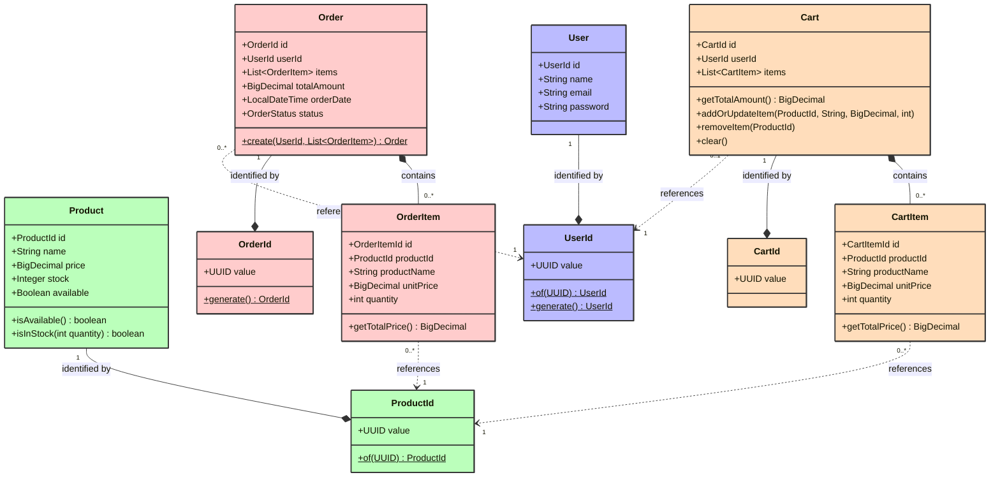

# E-Commerce application

- [Traefik](https://traefik.io/traefik) as gateway/reverse proxy
- Docker Compose to run all the microservices
- Swagger OpenAPI for documenting RESTful APIs

## Setup

Run `docker-compose up -d` and open:

- `http://localhost:8080/dashboard/` for the traefik dashboard
- `http://localhost/swagger/index.html` for swagger openAPI

## Domain architecture

